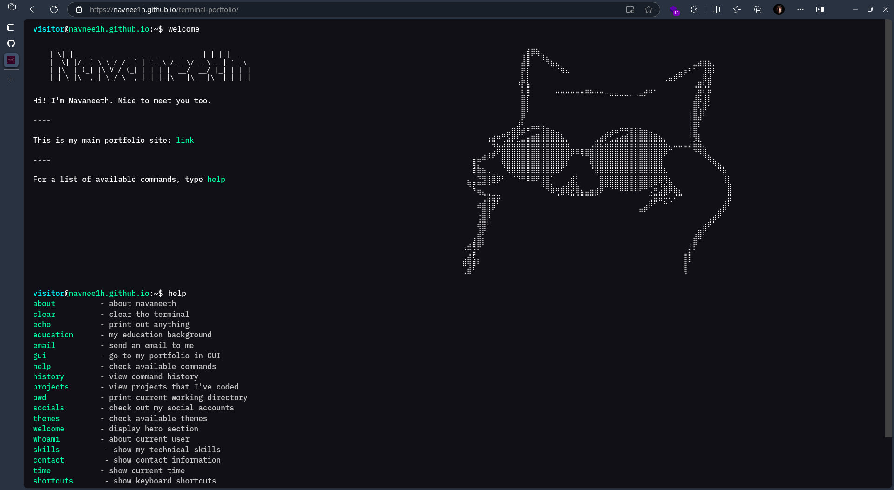

# 🖥️ Terminal Portfolio – Navaneeth M S

Welcome to my terminal-inspired portfolio website! This project is a fully interactive, terminal-style personal site built using modern web technologies. It mimics the experience of using a real command-line interface (CLI) directly in the browser.

---
## Note
The latest code and development versions are available on the **`gh-branch`** branch.
Please switch to the `gh-branch` branch to explore the complete source code and updates.

## 🚀 Features

- Terminal-style UI with real command input
- Custom commands:
  - `about` — Learn about me
  - `projects` — View my projects and work
  - `contact` — How to get in touch
  - `help` — List all available commands
  - `clear` — Clear the terminal screen
- ASCII art welcome screen
- Responsive and keyboard-friendly design
- Built with React and TypeScript

---

## 🧠 Tech Stack

- **React** + **TypeScript** for UI and logic
- **Styled-components** for styling
- Custom command parser and terminal emulation
- Deployment-ready for platforms like Vercel or Netlify

---

## 📁 Project Structure

```
src/
├── components/
│   ├── commands/          # Command components (About, Help, Projects, etc.)
│   ├── Terminal.tsx       # Terminal UI and input handling
│   └── Welcome.tsx        # Welcome screen with ASCII art
├── styles/                # Styled-components and global styles
├── App.tsx                # Root app component
└── main.tsx               # Entry point
```

---

## 📦 Getting Started

1. Clone this repo:
   ```bash
   git clone https://github.com/navnee1h/terminal-portfolio.git
   cd terminal-portfolio
   ```

2. Install dependencies:
   ```bash
   npm install
   ```

3. Start the development server:
   ```bash
   npm run dev
   ```

4. Open your browser at `http://localhost:3000` (or the port shown).

---

## 🌐 Live Demo

[click this link](https://navnee1h.github.io/terminal-portfolio/)

---

## 🛠️ Commands List

| Command    | Description                     |
|------------|---------------------------------|
| `about`    | Display info about me            |
| `projects` | Show my projects and work       |
| `contact`  | Show my contact information     |
| `help`     | List all available commands     |
| `clear`    | Clear the terminal screen       |

---

## 🙋‍♂️ About Me

Hi! I’m **Navaneeth M S**, a cyber forensics student and tech enthusiast passionate about building cool and secure software projects. This terminal portfolio is my way of showcasing my skills in a fun, interactive way!

---

## 📫 Contact

- Email: [navaneethms182@gmail.com](mailto:navaneethms182@gmail.com)  
- LinkedIn: [linkedin.com/in/navnee1h](https://linkedin.com/in/navnee1h)  
- GitHub: [github.com/navnee1h](https://github.com/navnee1h)

---

## 🎨 Screenshot



---
Special credits to [parsherr](https://github.com/parsherr) for creating the original Ubuntu version of this project.
---
> Built with ❤️ by Navaneeth M S
